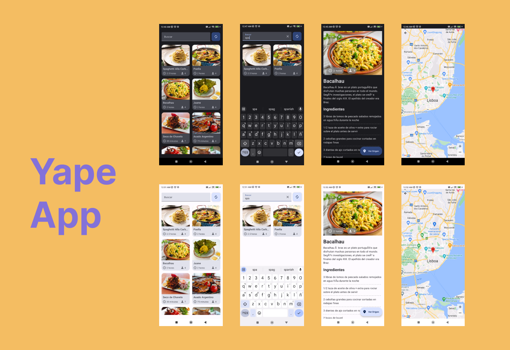
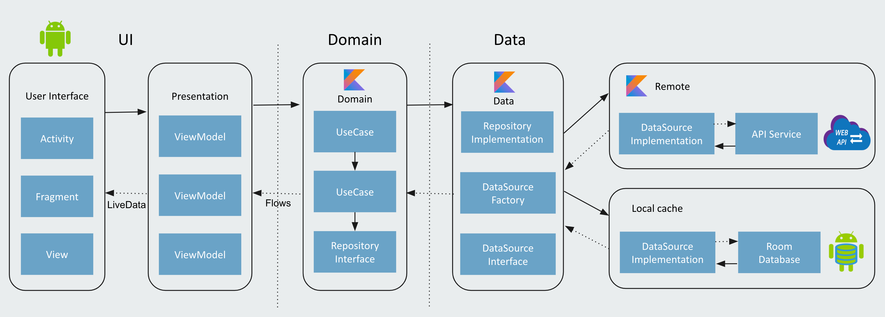

[GitHub](https://github.com/angelhr28/yape2024)

# Informe Técnico: Desarrollo de Aplicación Android

## Introducción

Este informe proporciona una visión integral del desarrollo de la aplicación Android, destacando la implementación de tecnologías y prácticas actuales recomendadas por Google. El proyecto se enfocó en la creación de una app modularizada, empleando Jetpack Compose, MVVM + MVI y Clean Architecture. Estas decisiones aseguran la escalabilidad, la inyección de dependencias y la realización de pruebas unitarias.

### Screenshots

## Arquitectura y Patrones de Diseño

### Arquitectura en Capas

- **Capa de Presentación:**
  Se implementó Jetpack Compose en conjunción con los patrones  MVI y MVVM. Esto facilita la separación de la lógica de la interfaz de usuario, manteniendo una clara división de responsabilidades.

- **Capa de Dominio:**
  En esta capa residen las reglas de negocio, los Use Cases y las Entities. Este enfoque permite mantener la independencia entre las capas superior e inferior.

- **Capa de Datos:**
  La gestión de acceso a datos se realizó mediante Repositories y Data Sources, proporcionando flexibilidad al cambiar las fuentes de datos, ya sea una API o una base de datos local.

### Patrones Utilizados

- **MVI (Model-View-Intent):**  
  Con un flujo unidireccional de datos, los eventos y acciones del usuario siguen un camino predecible, desde la Vista hasta el ViewModel, simplificando las pruebas unitarias y la gestión del estado de la aplicación.

- **MVVM (Model-View-ViewModel):** Este patrón facilita la separación de la lógica de la interfaz de usuario de los datos subyacentes, mejorando la mantenibilidad del código.

## Funcionalidades Destacadas

La aplicación se destaca por:

- **Almacenamiento Local con Room:**
  Utilización de Room para almacenar localmente las recetas. Esta estrategia minimiza las llamadas al servidor, optimizando la experiencia del usuario y reduciendo el consumo de datos móviles.

- **Actualización de Datos desde el Servidor:**
  Se implementó un botón que permite a los usuarios actualizar los datos desde el servidor según su conveniencia.

## Seguridad

Se implementaron medidas de seguridad como:

- **Ofuscación de Código:** Configurada para la compilación en modo release, dificultando la comprensión del código descompilado.

## Librerías Utilizadas

La aplicación se basa en las siguientes librerías:

- [**Kotlin**](https://kotlinlang.org/ "https://kotlinlang.org/")

- **[**Jetpack Compose**](https://developer.android.com/jetpack/compose?hl=es-419):** Framework moderno para el desarrollo de interfaces de usuario.
  -   [Room](https://developer.android.com/topic/libraries/architecture/room "https://developer.android.com/topic/libraries/architecture/room")  - Abstracción que simplifica la administración de bases de datos SQLite en Android.
  - [Compose Navigation](https://developer.android.com/jetpack/compose/navigation?hl=es-419) - Gestión eficiente de la navegación entre Composables, permitiendo el desarrollo de aplicaciones con una sola Activity.

  -   [Compose](https://developer.android.com/jetpack/compose "https://developer.android.com/jetpack/compose")  - Se utiliza para construir interfaces de usuario de manera declarativa.

- [**Flow:**](https://kotlin.github.io/kotlinx.coroutines/kotlinx-coroutines-core/kotlinx.coroutines.flow/)  Flow se utiliza para pasar (enviar) un flujo de datos que se pueden calcular de forma asíncrona.

- [**Coroutines:**](https://github.com/Kotlin/kotlinx.coroutines)  Una corrutina es un patrón de diseño de concurrencia que se puede utilizar en Android para simplificar el código que se ejecuta de forma asíncrona.

- **[Dagger-Hilt:](https://developer.android.com/training/dependency-injection/hilt-android "https://developer.android.com/training/dependency-injection/hilt-android")** Librería de inyección de dependencias que reduce el trabajo manual de inserción de dependencias.

- **[Coil:](https://coil-kt.github.io/coil/)** Potente librería para la carga eficiente de imágenes, con almacenamiento en caché para mejorar la velocidad de carga.

- **[Retrofit](https://github.com/square/retrofit "https://github.com/square/retrofit"):** Facilita las peticiones HTTP de manera simplificada.

  - [OkHttp](http://square.github.io/okhttp/ "http://square.github.io/okhttp/") - Un cliente HTTP que sea eficiente por defecto: el soporte para HTTP/2 permite que todas las solicitudes al mismo host compartan un socket.

  - [Gson](https://github.com/square/retrofit/tree/master/retrofit-converters/gson "https://github.com/square/retrofit/tree/master/retrofit-converters/gson") - Se utiliza para convertir objetos Java en su representación JSON y viceversa.

- **[Mockk](https://github.com/mockk/mockk "https://github.com/mockk/mockk"):** Herramientas esenciales para el desarrollo de pruebas unitarias.

-   [**Androidx-core**](https://androidx.tech/artifacts/arch.core/core-testing/ "https://androidx.tech/artifacts/arch.core/core-testing/")  - Allows working with LiveData in order to create dispatcher

- **Gradle Version Catalogs:** Estandariza y facilita la gestión de dependencias en diferentes módulos.

## Conclusiones

El proyecto se desarrolló con un enfoque en las mejores prácticas actuales, priorizando la modularización, seguridad y eficiencia. La implementación de una arquitectura limpia, patrones de diseño claros y medidas de seguridad robustas ha fortalecido la aplicación en términos de mantenibilidad y estabilidad.